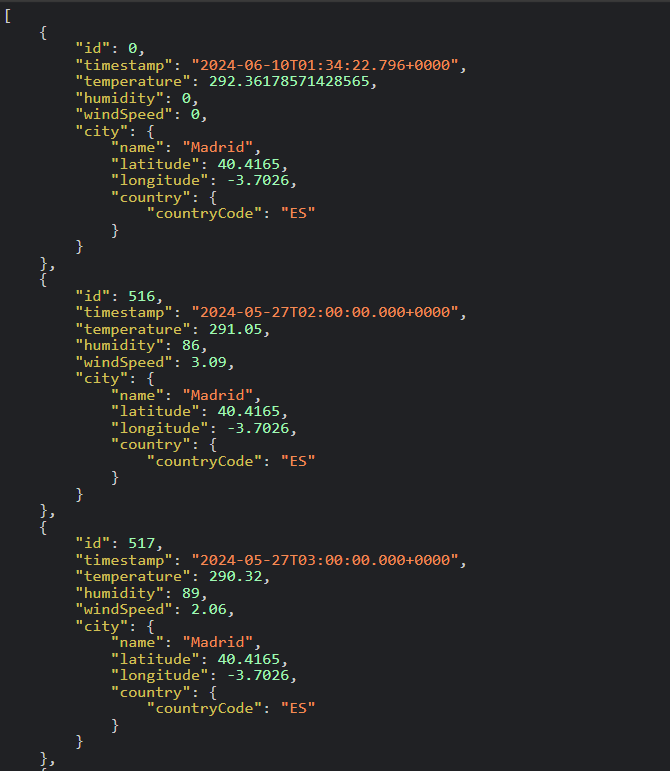

# Semestrální práce JPP
Autor: Jan Podávka

## Příklady volání rest api
Pro tyto platí, že na nultém indexu je vždy v tempature průměr
- dnešní přehled: http://127.0.0.1:8080/api/measurement/current?city=Paris
- Týdenní přehled: http://127.0.0.1:8080/api/measurement/week?city=Paris
- 14 denní přehled: http://127.0.0.1:8080/api/measurements/twoweek?city=Paris
